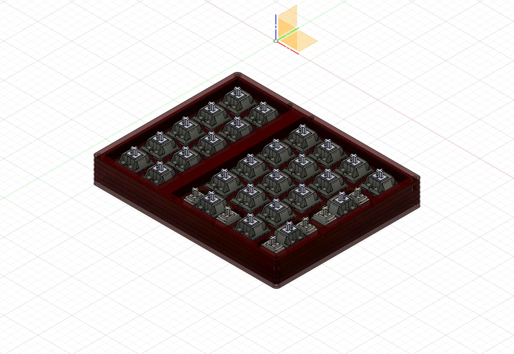
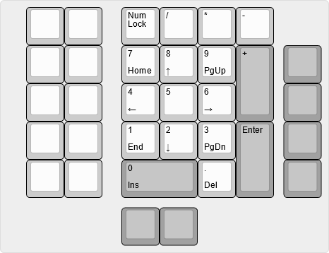

# Ahoy

Actual picture coming soon 

Ahoy is a simple but functional macropad designed for people who need both a numpad and a macro column for work/productivity. The features include:

- Numpad with split mod support
- 10 additional keys for macros
- Rotary encoder support on top left key
- 8 addressable RGB LEDs 
- Num, Caps, Scroll Lock Indicator LEDs
- USB C (USB 2.0)

The layout for the macropad can be seen below: 

## Instructions
To replicate the PCB and the case, the guide can be found below: 
- [Instructions on ordering this PCB](ahoy_pcb/gerber/production/)
- [Instructions on ordering the case](acrylic_case/)

## Project Status
- [x] Design PCB
- [x] Design Case
- [ ] Order Prototypes
- [ ] Create bootloader
- [ ] Create QMK/VIA firmware
- [ ] Revise prototypes
### Todo List
- [ ] Revise LED cutouts on acrylic case 
- [ ] \(Optional) add art/silkscreen
- [ ] Clear @todo 's 
## Licensing 
The following project was built on Gondolindrim's [Acheron Project](https://github.com/AcheronProject) and ai03's [PCB guide](https://wiki.ai03.com/books/pcb-design/chapter/pcb-designer-guide) and [design files](https://github.com/ai03-2725). As such, the licensing will follow their licensing arrangement on top of this project's licensing, which can be found [here](LICENSE).